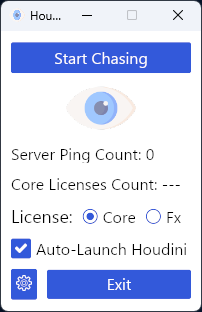

# Houdini License Chaser

Do you work in a studio with a limited Houdini license number? 

Are you tired of waiting for someone to close their Houdini session, so you could 
steal their license?

Wait no more! Cheat! This little app will ping the Houdini license server every 2 seconds 
and will launch Houdini the moment a free license becomes available!

P.S. Don't tell about it to your colleagues, you've been warned! 
If you get caught cheating, create an issue in this repo, I want to know about it.

# Build & Run
1. Make sure you have a Rust toolchain installed
2. Clone the repository
3 `cargo build --release` and copy the executable to your preferred location
    - Or `cargo run --release` to start it right away.

**Tested on Windows and Mac**

# Config
The app configuration is stored:
- On Windows: `%USERPROFILE%\AppData\Roaming\houdini.license.chaser\config.json`
- On Linux: `$HOME/.config/houdini.license.chaser/config.json`
- On Mac: `$HOME/Library/Application Support/houdini.license.chaser/config.json`

